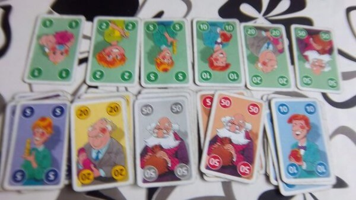

# Familie Poen

Branch|[](https://travis-ci.org)|[](https://www.codecov.io)
---|---|---
master|[](https://travis-ci.org/richelbilderbeek/familie_poen) | [](https://codecov.io/github/richelbilderbeek/familie_poen?branch=master)
develop|[](https://travis-ci.org/richelbilderbeek/familie_poen) | [](https://codecov.io/github/richelbilderbeek/familie_poen?branch=develop)

Card game.



 * Cards have values 1,2,5,10,20,50
 * Each card has 6 colors
 * Initial coins: 1 x 50, 1 x 20, 2 x 10, 2 x 5, 4 x 2, 4 x 1 = 112

## Results

### Two player matches

Matchup|First player wins|Second player wins
---|---|---
LL|508434|491566
LH|511433|488567
HL|511206|488794
HH|508699|491301

What to do as a first player:
 * No info: 
    * When playing L, you'll win 508434 + 511433 = 1019867
    * When playing H, you'll win 511206 + 508699 = 1019905
    * Conlusion: it does not matter, you will win 51% of all times
 * Other plays L:
    * When playing L (LL), you'll win 508434 
    * When playing H (HL), you'll win 511206   
    * Conlusion: it does not matter, you will win 51% of all times
 * Other plays H:
    * When playing L (LH), you'll win 511433 
    * When playing H (HH), you'll win 508699    
    * Conlusion: it does not matter, you will win 51% of all times
 * Conclusion: even if knowing what the other plays, player
   1 will win 51% of all cases

```
Player 1 playing L won 508434 times
Player 2 playing L won 491566 times
```

```
Player 1 playing L won 511433 times
Player 2 playing H won 488567 times
```

```
Player 1 playing H won 511206 times
Player 2 playing L won 488794 times
```

```
Player 1 playing H won 508699 times
Player 2 playing H won 491301 times
```

### Three player matches

Matchup|First player wins|Second player wins|Third player wins
---|---|---
LLL|.|.|.
LLH|.|.|.
LHL|.|.|.
LHH|.|.|.
HLL|.|.|.
HLH|.|.|.
HHL|.|.|.
HHH|.|.|.

Player 1 playing L won 343617 times
Player 2 playing L won 333134 times
Player 3 playing L won 323249 times


Player 1 playing L won 350884 times
Player 2 playing L won 311338 times
Player 3 playing H won 337778 times

Player 1 playing L won 323798 times
Player 2 playing H won 350744 times
Player 3 playing L won 325458 times

Player 1 playing L won 364319 times
Player 2 playing H won 336266 times
Player 3 playing H won 299415 times

Player 1 playing H won 364166 times
Player 2 playing L won 336025 times
Player 3 playing L won 299809 times

Player 1 playing H won 324299 times
Player 2 playing L won 351300 times
Player 3 playing H won 324401 times

Player 1 playing H won 351325 times
Player 2 playing H won 311875 times
Player 3 playing L won 336800 times

Player 1 playing H won 343733 times
Player 2 playing H won 333531 times
Player 3 playing H won 322736 times
