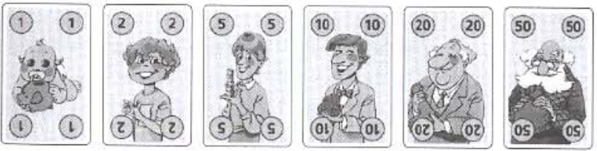

# Familie Poen

Branch|[](https://travis-ci.org)|[](https://www.codecov.io)
---|---|---
master|[](https://travis-ci.org/richelbilderbeek/familie_poen) | [](https://codecov.io/github/richelbilderbeek/familie_poen?branch=master)
develop|[](https://travis-ci.org/richelbilderbeek/familie_poen) | [](https://codecov.io/github/richelbilderbeek/familie_poen?branch=develop)

`Familie Poen` is a card game.


## Goal

Goal of this experiment is to find out if there are strategies
that are easy and better.

Strategy|Description
---|---
C|Play cards that are common in hands of others (they are rare in player's hand nor in played pile) 
H|Always play the card with the highest value
R|Play randomly
L|Always play the card with the lowest value
U|Play cards that are uncommon/rare in hands of others (they are common in player's hand and in played pile) 

## Methods

  * Assign 2, 3, or 4 players with a fixed strategy, in all combinations
    of strategies
  * Play 1M games, score who wins

## Results

Whatever strategy, the first player has an advantage of
51%, 34.6% and 27.7% in 2, 3 and 4 player games respectively.

## Discussion

There may be smarter strategies, for example, those that
count cards.

## Short manual

`Familie Poen` is a 2-4 player game

### Cards

There are 36 cards, as there is a card for
each combination of one of the six colors and one of the six value.
Values are: 1, 2, 5, 10, 20, 50.



### Setup

 * Each player gets 112 coins (1 x 50, 1 x 20, 2 x 10, 2 x 5, 4 x 2, 4 x 1)
 * Each player get five random cards
 * The other cards are put on drawing pile
 * Top card of drawing pile is put open on playing pile

## Playing

 * The active player must place any card on the playing
   pile that has either the same color or value. If
   the player does so, it is the next player's turn
 * If no card can be played, the active player must draw a card.
   If that card can be played, it is played. Then, it is
   the next player's turn.
 * Whoever gets rid of all cards wins the game

## Results

### Two player matches

```
cat *.log | egrep ".*\|.*" -o
```

Matchup|First player wins|Second player wins
---|---|---
CC|52.2012|47.7988
CH|47.9993|52.0007
CL|47.5984|52.4016
CR|48.1627|51.8373
CU|44.3608|55.6392
HC|56.1318|43.8682
HH|51.61|48.39
HL|51.8642|48.1358
HR|52.1526|47.8474
HU|48.2165|51.7835
LC|56.3672|43.6328
LH|51.8426|48.1574
LL|51.6373|48.3627
LR|52.0926|47.9074
LU|48.5655|51.4345
RC|55.7963|44.2037
RH|51.1961|48.8039
RL|51.3625|48.6375
RR|51.7178|48.2822
RU|47.9368|52.0632
UC|59.0546|40.9454
UH|54.7955|45.2045
UL|54.3489|45.6511
UR|54.8951|45.1049
UU|51.2759|48.7241

What to do as any player:

 * Play U

To counteract this:
 * As player 1: play U. This is the only way to have above 50% chance to win 
 * As player 2: play U. This is the least worst

When playing U against HLR, you'll win 55% as player 1
and 52% as player 2, in total you'll win 53.5% on average.

### Three player matches

Matchup|First player wins|Second player wins|Third player wins
---|---|---|---
CCC|36.0261|33.2597|30.7142
CCH|32.8364|31.8685|35.2951
CCL|32.4443|31.9091|35.6466
CCR|32.6441|31.8137|35.5422
CCU|29.4477|30.6711|39.8812
CHC|34.2645|38.0588|27.6767
CHH|31.9984|36.7385|31.2631
CHL|30.9933|36.7926|32.2141
CHR|31.4431|36.7373|31.8196
CHU|28.6393|35.4394|35.9213
CLC|34.3951|38.2088|27.3961
CLH|31.4388|36.5054|32.0558
CLL|31.3536|36.8836|31.7628
CLR|31.3876|36.6932|31.9192
CLU|28.7941|35.5536|35.6523
CRC|34.2987|38.1554|27.5459
CRH|31.6129|36.6275|31.7596
CRL|31.1138|36.8168|32.0694
CRR|31.4501|36.7911|31.7588
CRU|28.7178|35.4639|35.8183
CUC|32.8746|42.4646|24.6608
CUH|30.6379|40.9475|28.4146
CUL|30.1765|40.9804|28.8431
CUR|30.3015|40.9877|28.7108
CUU|28.1223|39.6205|32.2572
HCC|40.8603|30.1122|29.0275
HCH|36.3221|29.6462|34.0317
HCL|37.5637|28.9742|33.4621
HCR|36.8951|29.339|33.7659
HCU|33.5026|28.4197|38.0777
HHC|39.2146|33.9084|26.877
HHH|35.5635|33.5005|30.936
HHL|36.3067|32.6865|31.0068
HHR|35.9701|33.0335|30.9964
HHU|32.8687|31.9921|35.1392
HLC|39.1486|34.7647|26.0867
HLH|34.8596|34.082|31.0584
HLL|36.4399|33.6172|29.9429
HLR|35.6433|33.8675|30.4892
HLU|32.7842|32.9874|34.2284
HRC|39.1662|34.3475|26.4863
HRH|35.1794|33.808|31.0126
HRL|36.3725|33.1318|30.4957
HRR|35.7508|33.4775|30.7717
HRU|32.7469|32.6|34.6531
HUC|37.6029|38.5165|23.8806
HUH|33.8799|38.0051|28.115
HUL|35.2542|37.1024|27.6434
HUR|34.6682|37.4935|27.8383
HUU|32.0409|36.4784|31.4807
LCC|40.9774|29.8354|29.1872
LCH|37.6052|28.7158|33.679
LCL|36.5949|29.1503|34.2548
LCR|37.1313|28.9123|33.9564
LCU|33.5589|28.1775|38.2636
LHC|38.8833|34.7431|26.3736
LHH|36.4179|33.6696|29.9125
LHL|34.8488|34.0622|31.089
LHR|35.6621|33.8707|30.4672
LHU|32.4332|33.0377|34.5291
LLC|39.3869|34.1569|26.4562
LLH|36.3429|32.6789|30.9782
LLL|35.5815|33.4901|30.9284
LLR|35.9672|33.0623|30.9705
LLU|32.9812|32.3475|34.6713
LRC|39.1492|34.4296|26.4212
LRH|36.3222|33.1355|30.5423
LRL|35.1734|33.7424|31.0842
LRR|35.7899|33.4253|30.7848
LRU|32.7065|32.6626|34.6309
LUC|37.7528|38.1333|24.1139
LUH|35.3871|36.8137|27.7992
LUL|34.3064|37.317|28.3766
LUR|34.8154|37.0949|28.0897
LUU|32.2194|36.1552|31.6254
RCC|40.9012|30.0293|29.0695
RCH|36.9534|29.2444|33.8022
RCL|37.0657|29.0686|33.8657
RCR|37.0027|29.1799|33.8174
RCU|33.5724|28.3471|38.0805
RHC|39.0922|34.263|26.6448
RHH|35.9383|33.6597|30.402
RHL|35.6534|33.2995|31.0471
RHR|35.7803|33.4608|30.7589
RHU|32.7453|32.4674|34.7873
RLC|39.3024|34.4574|26.2402
RLH|35.5672|33.371|31.0618
RLL|36.0668|33.5381|30.3951
RLR|35.7916|33.5139|30.6945
RLU|32.8559|32.6996|34.4445
RRC|39.1564|34.3302|26.5134
RRH|35.8205|33.5193|30.6602
RRL|35.7225|33.4736|30.8039
RRR|35.8241|33.4079|30.768
RRU|32.7392|32.589|34.6718
RUC|37.7455|38.2785|23.976
RUH|34.6193|37.4445|27.9362
RUL|34.7556|37.2227|28.0217
RUR|34.7961|37.2843|27.9196
RUU|32.1211|36.3636|31.5153
UCC|45.2052|27.057|27.7378
UCH|41.1544|26.4949|32.3507
UCL|40.7082|26.6477|32.6441
UCR|40.9693|26.5195|32.5112
UCU|37.0823|26.1674|36.7503
UHC|43.403|30.9908|25.6062
UHH|40.1901|30.6534|29.1565
UHL|39.2183|30.5181|30.2636
UHR|39.7204|30.6035|29.6761
UHU|36.1565|30.065|33.7785
ULC|43.3867|31.2108|25.4025
ULH|39.6359|30.3919|29.9722
ULL|39.5362|30.8464|29.6174
ULR|39.6294|30.5964|29.7742
ULU|36.3511|30.2223|33.4266
URC|43.4044|31.0636|25.532
URH|39.8151|30.5703|29.6146
URL|39.3174|30.7133|29.9693
URR|39.7026|30.5399|29.7575
URU|36.2245|30.1164|33.6591
UUC|41.8722|34.6776|23.4502
UUH|38.6822|34.0579|27.2599
UUL|38.3081|34.1573|27.5346
UUR|38.5243|34.0945|27.3812
UUU|35.5598|33.5405|30.8997

What to do as a first player:
 * Play cards that are uncommon in hands; 
   that combine with as much cards on the table and in hand possible

## Four players

Matchup|1 wins|2 wins|3 wins|4 wins
---|---|---|---|---
CCCC|27.8468|25.8737|23.989|22.2905
CCCH|25.3125|24.8936|23.4241|26.3698
CCCL|24.9163|24.896|23.6207|26.567
CCCR|25.068|24.8749|23.5077|26.5494
CCCU|22.3989|23.826|23.0473|30.7278
CCHC|26.6265|25.1475|28.275|19.951
CCHH|24.6112|24.5083|27.8323|23.0482
CCHL|23.8909|24.2004|27.9285|23.9802
CCHR|24.326|24.2989|27.8053|23.5698
CCHU|21.7447|23.3644|27.4104|27.4805
CCLC|26.5703|25.1818|28.4056|19.8423
CCLH|24.2627|24.2338|27.6154|23.8881
CCLL|24.0275|24.4384|28.1848|23.3493
CCLR|24.129|24.259|27.8513|23.7607
CCLU|21.8003|23.4496|27.4869|27.2632
CCRC|26.4858|25.0929|28.4873|19.934
CCRH|24.3824|24.2836|27.9344|23.3996
CCRL|23.9252|24.2427|28.2083|23.6238
CCRR|24.1124|24.21|28.0295|23.6481
CCRU|21.7153|23.3646|27.5509|27.3692
CCUC|25.2606|24.3349|32.7889|17.6156
CCUH|23.2822|23.6398|32.2921|20.7859
CCUL|22.9728|23.627|32.4597|20.9405
CCUR|23.1482|23.5948|32.2751|20.9819
CCUU|21.0183|22.8967|31.8486|24.2364
CHCC|26.9539|30.4026|21.5746|21.0689
CHCH|24.711|29.0231|21.2841|24.9818
CHCL|24.2416|29.586|21.1866|24.9858
CHCR|24.4582|29.2942|21.1205|25.1271
CHCU|21.9394|28.0904|20.7877|29.1825
CHHC|26.1514|29.8372|24.7512|19.2602
CHHH|24.4192|28.8966|24.5095|22.1747
CHHL|23.4787|29.0496|24.403|23.0687
CHHR|23.9461|28.9342|24.4093|22.7104
CHHU|21.5475|27.8807|23.9793|26.5925
CHLC|25.7504|29.7213|25.7361|18.7922
CHLH|23.6756|28.2995|25.3074|22.7175
CHLL|23.4011|29.1009|25.4524|22.0456
CHLR|23.522|28.6274|25.2915|22.5591
CHLU|21.309|27.7362|25.0178|25.937
CHRC|25.8982|29.7674|25.3522|18.9822
CHRH|24.0565|28.5366|24.9647|22.4422
CHRL|23.3947|29.0115|25.049|22.5448
CHRR|23.7144|28.729|24.9787|22.5779
CHRU|21.4227|27.7453|24.6296|26.2024
CHUC|24.7268|29.0223|29.3306|16.9203
CHUH|23.0768|27.8204|29.1171|19.9857
CHUL|22.5204|28.4368|28.9849|20.0579
CHUR|22.8119|28.1078|28.9311|20.1492
CHUU|20.7333|27.304|28.5985|23.3642
CLCC|26.9746|30.6281|21.3177|21.0796
CLCH|24.5866|29.4307|20.945|25.0377
CLCL|24.3128|29.4408|21.0725|25.1739
CLCR|24.4463|29.3628|20.937|25.2539
CLCU|21.9738|28.228|20.6124|29.1858
CLHC|25.9045|29.5633|25.6267|18.9055
CLHH|23.9851|28.8183|25.3239|21.8727
CLHL|23.2987|28.4798|25.4121|22.8094
CLHR|23.5822|28.6144|25.3323|22.4711
CLHU|21.3217|27.5293|25.0186|26.1304
CLLC|26.0391|30.0199|24.9823|18.9587
CLLH|23.7996|28.8586|24.4115|22.9303
CLLL|23.6571|29.0976|24.8385|22.4068
CLLR|23.6885|28.9551|24.5506|22.8058
CLLU|21.5524|28.0121|24.2682|26.1673
CLRC|25.8575|29.7921|25.401|18.9494
CLRH|23.7558|28.8433|24.977|22.4239
CLRL|23.397|28.7539|25.253|22.5961
CLRR|23.5921|28.7522|24.9532|22.7025
CLRU|21.3985|27.7423|24.7221|26.1371
CLUC|24.9109|29.1522|28.9858|16.9511
CLUH|22.9585|28.2681|28.6583|20.1151
CLUL|22.7441|28.2901|28.7347|20.2311
CLUR|22.8708|28.1598|28.6633|20.3061
CLUU|20.8746|27.3958|28.2813|23.4483
CRCC|26.8687|30.7396|21.4646|20.9271
CRCH|24.5872|29.4323|21.0304|24.9501
CRCL|24.1764|29.6712|21.1297|25.0227
CRCR|24.4004|29.3823|21.0412|25.1761
CRCU|21.8399|28.3069|20.7044|29.1488
CRHC|25.9568|29.9205|25.0584|19.0643
CRHH|24.104|29.0317|24.8607|22.0036
CRHL|23.3383|28.8965|24.8956|22.8696
CRHR|23.7452|28.8658|24.8457|22.5433
CRHU|21.3119|27.8419|24.5462|26.3
CRLC|25.8318|30.0308|25.3629|18.7745
CRLH|23.6776|28.7559|24.7736|22.7929
CRLL|23.4057|29.3276|25.1892|22.0775
CRLR|23.5215|29.0021|24.9649|22.5115
CRLU|21.3892|28.0931|24.595|25.9227
CRRC|25.8084|29.9474|25.3537|18.8905
CRRH|23.7542|28.856|25.0181|22.3717
CRRL|23.2873|29.0704|25.184|22.4583
CRRR|23.5352|28.8916|25.036|22.5372
CRRU|21.272|27.8809|24.6287|26.2184
CRUC|24.8222|29.2424|29.0866|16.8488
CRUH|22.9206|28.1924|28.888|19.999
CRUL|22.577|28.4784|28.9164|20.0282
CRUR|22.6855|28.313|28.8199|20.1816
CRUU|20.7033|27.4863|28.5083|23.3021
CUCC|26.066|35.2331|18.9824|19.7185
CUCH|23.8846|33.9196|18.6592|23.5366
CUCL|23.5075|33.9804|18.8376|23.6745
CUCR|23.7022|33.795|18.7163|23.7865
CUCU|21.3089|32.6023|18.517|27.5718
CUHC|25.2715|34.445|22.2988|17.9847
CUHH|23.5389|33.5728|22.0756|20.8127
CUHL|22.7746|33.2524|22.1688|21.8042
CUHR|23.1744|33.3595|22.0582|21.4079
CUHU|20.93|32.1126|21.9233|25.0341
CULC|25.1392|34.5354|22.426|17.8994
CULH|23.0744|33.2161|21.9801|21.7294
CULL|22.9039|33.5207|22.3808|21.1946
CULR|23.0117|33.2945|22.1039|21.5899
CULU|20.9284|32.2378|21.9899|24.8439
CURC|25.1465|34.443|22.4664|17.9441
CURH|23.2674|33.3354|22.1577|21.2395
CURL|22.7717|33.324|22.3973|21.507
CURR|23.0409|33.291|22.2294|21.4387
CURU|20.908|32.092|22.0303|24.9697
CUUC|24.3129|33.7426|25.7537|16.1908
CUUH|22.5577|32.6789|25.5579|19.2055
CUUL|22.2359|32.7661|25.6345|19.3635
CUUR|22.3214|32.7411|25.5045|19.433
CUUU|20.4777|31.7352|25.3426|22.4445
HCCC|32.5625|23.3552|22.6893|21.393
HCCH|28.5997|22.9815|22.6603|25.7585
HCCL|29.9145|22.4635|22.2984|25.3236
HCCR|29.255|22.5737|22.4908|25.6805
HCCU|26.2596|21.7584|22.1416|29.8404
HCHC|30.9323|22.8431|26.8103|19.4143
HCHH|27.6195|22.7984|26.9569|22.6252
HCHL|28.51|21.9545|26.3963|23.1392
HCHR|27.9991|22.3254|26.6344|23.0411
HCHU|25.3403|21.5893|26.2142|26.8562
HCLC|31.2994|22.8091|26.7392|19.1523
HCLH|27.5511|22.4006|26.6307|23.4176
HCLL|28.9875|22.0635|26.5131|22.4359
HCLR|28.2338|22.1353|26.55|23.0809
HCLU|25.6749|21.4246|26.2986|26.6019
HCRC|31.0852|22.7399|26.9397|19.2352
HCRH|27.502|22.5971|26.9451|22.9558
HCRL|28.6708|22.0098|26.5529|22.7665
HCRR|28.0811|22.187|26.7812|22.9507
HCRU|25.4441|21.5122|26.4377|26.606
HCUC|29.6609|22.1674|31.1214|17.0503
HCUH|26.3226|22.0345|31.2266|20.4163
HCUL|27.6362|21.4427|30.7354|20.1857
HCUR|27.042|21.6805|30.8978|20.3797
HCUU|24.6392|21.1445|30.5841|23.6322
HHCC|31.877|26.696|20.8551|20.5719
HHCH|28.1394|26.0326|21.0665|24.7615
HHCL|29.4049|25.866|20.4473|24.2818
HHCR|28.7323|25.8758|20.708|24.6839
HHCU|25.8515|24.9341|20.3949|28.8195
HHHC|30.688|26.2978|23.9316|19.0826
HHHH|27.5943|26.0243|24.2038|22.1776
HHHL|28.288|25.511|23.5056|22.6954
HHHR|27.9299|25.731|23.7753|22.5638
HHHU|25.2943|24.8834|23.3969|26.4254
HHLC|30.7376|26.1191|24.6997|18.4436
HHLH|27.1531|25.4129|24.8859|22.5481
HHLL|28.5711|25.4635|24.4447|21.5207
HHLR|27.8941|25.3234|24.6796|22.1029
HHLU|25.2467|24.6183|24.4483|25.6867
HHRC|30.6518|26.1592|24.4998|18.6892
HHRH|27.3358|25.6384|24.6539|22.3719
HHRL|28.3878|25.4623|24.0807|22.0692
HHRR|27.8666|25.4588|24.3272|22.3474
HHRU|25.1646|24.7257|24.0719|26.0378
HHUC|29.3782|25.5507|28.3506|16.7205
HHUH|26.2049|25.0794|28.7074|20.0083
HHUL|27.395|24.9444|27.9782|19.6824
HHUR|26.811|24.9495|28.3464|19.8931
HHUU|24.4494|24.3213|28.0537|23.1756
HLCC|31.714|27.7809|20.2281|20.277
HLCH|27.8606|27.3524|20.3053|24.4817
HLCL|29.3016|26.7201|19.9561|24.0222
HLCR|28.5669|26.9478|20.0499|24.4354
HLCU|25.8224|26.039|19.8111|28.3275
HLHC|30.1453|27.0646|24.411|18.3791
HLHH|26.8616|27.0213|24.615|21.5021
HLHL|27.861|26.0112|24.1084|22.0194
HLHR|27.3379|26.4499|24.299|21.9132
HLHU|24.8035|25.6323|24.0408|25.5234
HLLC|30.746|27.333|23.5994|18.3216
HLLH|27.0158|26.79|23.6267|22.5675
HLLL|28.6768|26.4359|23.4113|21.476
HLLR|27.7839|26.595|23.4578|22.1633
HLLU|25.4597|25.7809|23.2516|25.5078
HLRC|30.4044|27.1261|24.127|18.3425
HLRH|26.8961|26.8114|24.2626|22.0299
HLRL|28.2261|26.1339|23.8878|21.7522
HLRR|27.5516|26.4609|24.009|21.9785
HLRU|25.0911|25.6318|23.7203|25.5568
HLUC|29.2496|26.6389|27.6595|16.452
HLUH|25.9199|26.418|27.8577|19.8044
HLUL|27.3537|25.7614|27.3277|19.5572
HLUR|26.6367|26.0501|27.5496|19.7636
HLUU|24.3948|25.3822|27.2641|22.9589
HRCC|31.7777|27.3684|20.4987|20.3552
HRCH|27.9039|26.8457|20.6665|24.5839
HRCL|29.2789|26.4678|20.1955|24.0578
HRCR|28.5209|26.5552|20.3933|24.5306
HRCU|25.7821|25.6096|20.1044|28.5039
HRHC|30.3657|26.8414|24.1029|18.69
HRHH|27.1699|26.6655|24.3598|21.8048
HRHL|27.9717|25.9521|23.7729|22.3033
HRHR|27.5987|26.2479|23.9273|22.2261
HRHU|24.9921|25.4652|23.6953|25.8474
HRLC|30.696|26.8786|24.0802|18.3452
HRLH|26.9813|26.3304|24.1722|22.5161
HRLL|28.4988|26.1324|23.9493|21.4195
HRLR|27.7044|26.1278|24.0114|22.1564
HRLU|25.3013|25.2686|23.859|25.5711
HRRC|30.4722|26.7821|24.3099|18.4358
HRRH|26.9895|26.407|24.3754|22.2281
HRRL|28.289|25.914|23.9097|21.8873
HRRR|27.6259|26.0936|24.1867|22.0938
HRRU|25.148|25.3181|23.8982|25.6357
HRUC|29.3441|26.1745|27.9174|16.564
HRUH|26.033|25.9223|28.2428|19.8019
HRUL|27.3509|25.4836|27.6347|19.5308
HRUR|26.625|25.6665|27.8949|19.8136
HRUU|24.3467|24.9338|27.7355|22.984
HUCC|30.8528|31.5828|18.2806|19.2838
HUCH|27.1392|31.0342|18.4662|23.3604
HUCL|28.6008|30.3966|18.0459|22.9567
HUCR|27.8923|30.6261|18.1779|23.3037
HUCU|25.1878|29.5777|18.0461|27.1884
HUHC|29.5704|31.0326|21.5901|17.8069
HUHH|26.4444|30.942|21.8783|20.7353
HUHL|27.3853|29.9105|21.3413|21.3629
HUHR|26.9395|30.3737|21.4921|21.1947
HUHU|24.4216|29.4381|21.3456|24.7947
HULC|30.0233|31.0284|21.4803|17.468
HULH|26.4157|30.4232|21.6058|21.5553
HULL|28.0571|30.0123|21.3859|20.5447
HULR|27.2367|30.1538|21.4123|21.1972
HULU|24.8422|29.2703|21.3453|24.5422
HURC|29.7448|30.9609|21.6434|17.6509
HURH|26.3868|30.6124|21.8509|21.1499
HURL|27.7176|29.9251|21.4362|20.9211
HURR|27.0322|30.2129|21.5688|21.1861
HURU|24.6125|29.2817|21.4406|24.6652
HUUC|28.7205|30.4396|24.9078|15.9321
HUUH|25.527|30.0976|25.2501|19.1253
HUUL|26.9353|29.4439|24.6996|18.9212
HUUR|26.2033|29.7735|24.8953|19.1279
HUUU|24.014|28.9582|24.787|22.2408
LCCC|32.3984|23.1527|22.8895|21.5594
LCCH|29.9173|22.2557|22.2439|25.5831
LCCL|28.7262|22.5884|22.7281|25.9573
LCCR|29.2569|22.3219|22.5021|25.9191
LCCU|26.1651|21.6511|22.1563|30.0275
LCHC|31.0239|22.561|27.0275|19.3876
LCHH|29.0449|21.9787|26.6366|22.3398
LCHL|27.5257|22.0137|26.9332|23.5274
LCHR|28.331|21.8819|26.755|23.0321
LCHU|25.3563|21.2591|26.4712|26.9134
LCLC|30.9681|22.5956|27.1471|19.2892
LCLH|28.7428|21.7265|26.2957|23.235
LCLL|27.6898|22.2573|27.1621|22.8908
LCLR|28.1524|21.9572|26.6702|23.2202
LCLU|25.4983|21.3723|26.4717|26.6577
LCRC|30.9406|22.4895|27.2462|19.3237
LCRH|28.8366|21.7649|26.6287|22.7698
LCRL|27.5643|22.0491|27.1659|23.2207
LCRR|28.1096|21.8604|26.8832|23.1468
LCRU|25.3783|21.2944|26.5653|26.762
LCUC|29.6032|21.9105|31.3102|17.1761
LCUH|27.7005|21.2802|30.6891|20.3302
LCUL|26.5859|21.5617|31.2452|20.6072
LCUR|27.1428|21.3993|30.883|20.5749
LCUU|24.7097|20.8806|30.6058|23.8039
LHCC|31.302|27.7889|20.5475|20.3616
LHCH|29.0463|26.5644|20.1992|24.1901
LHCL|27.8366|27.3254|20.435|24.403
LHCR|28.4819|26.8996|20.2126|24.4059
LHCU|25.4508|26.1162|20.0215|28.4115
LHHC|30.352|27.3361|23.6401|18.6718
LHHH|28.6811|26.4299|23.4034|21.4856
LHHL|26.9758|26.8875|23.5534|22.5833
LHHR|27.8489|26.5492|23.4492|22.1527
LHHU|24.9997|25.848|23.2037|25.9486
LHLC|29.9444|27.2759|24.5676|18.2121
LHLH|27.9073|25.9974|24.0624|22.0329
LHLL|26.8105|27.0465|24.5476|21.5954
LHLR|27.3112|26.4848|24.236|21.968
LHLU|24.7329|25.8437|24.1348|25.2886
LHRC|30.0518|27.2806|24.2288|18.4388
LHRH|28.1881|26.191|23.8759|21.745
LHRL|26.8208|26.9207|24.2303|22.0282
LHRR|27.5139|26.4442|24.0403|22.0016
LHRU|24.8624|25.763|23.7664|25.6082
LHUC|28.8879|26.6488|27.9926|16.4707
LHUH|27.1977|25.5582|27.7133|19.5308
LHUL|25.9217|26.4648|27.8739|19.7396
LHUR|26.561|25.9137|27.8048|19.7205
LHUU|24.1641|25.4008|27.534|22.9011
LLCC|31.7873|26.9937|20.6165|20.6025
LLCH|29.3827|25.9444|20.1253|24.5476
LLCL|28.2172|26.3036|20.6012|24.878
LLCR|28.8181|26.0452|20.2575|24.8792
LLCU|25.8693|25.214|20.1285|28.7882
LLHC|30.4877|26.1354|24.8119|18.565
LLHH|28.5798|25.5114|24.4539|21.4549
LLHL|27.0433|25.5269|24.8375|22.5923
LLHR|27.8473|25.4516|24.5484|22.1527
LLHU|25.0866|24.7003|24.4646|25.7485
LLLC|30.6838|26.5216|24.1202|18.6744
LLLH|28.4186|25.4673|23.4728|22.6413
LLLL|27.4688|26.0206|24.2828|22.2278
LLLR|27.9193|25.7204|23.7763|22.584
LLLU|25.3957|25.0701|23.6555|25.8787
LLRC|30.4763|26.3237|24.5946|18.6054
LLRH|28.4331|25.4303|24.0804|22.0562
LLRL|27.2318|25.7108|24.6848|22.3726
LLRR|27.7853|25.5023|24.3483|22.3641
LLRU|25.2197|24.7681|24.161|25.8512
LLUC|29.4446|25.7438|28.005|16.8066
LLUH|27.5466|24.9987|27.5024|19.9523
LLUL|26.4533|25.3037|28.0484|20.1946
LLUR|26.9945|25.0748|27.7367|20.194
LLUU|24.6659|24.5611|27.4899|23.2831
LRCC|31.4849|27.5327|20.5222|20.4602
LRCH|29.0877|26.4409|20.1409|24.3305
LRCL|27.9658|27.0169|20.4822|24.5351
LRCR|28.5285|26.6562|20.2207|24.5946
LRCU|25.5357|25.875|20.1257|28.4636
LRHC|30.3936|26.8918|24.2206|18.494
LRHH|28.5438|26.1391|23.912|21.4051
LRHL|26.969|26.3548|24.1396|22.5366
LRHR|27.7592|26.0993|24.0863|22.0552
LRHU|25.027|25.4066|23.7681|25.7983
LRLC|30.1921|27.0736|24.3695|18.3648
LRLH|28.0489|25.9208|23.7991|22.2312
LRLL|27.1159|26.6813|24.3709|21.8319
LRLR|27.5764|26.2515|24.0194|22.1527
LRLU|24.9571|25.6519|23.8955|25.4955
LRRC|30.2046|26.9849|24.413|18.3975
LRRH|28.2151|25.9554|23.9506|21.8789
LRRL|27.006|26.4853|24.3469|22.1618
LRRR|27.6349|26.1853|24.1638|22.016
LRRU|24.9738|25.4452|23.9443|25.6367
LRUC|29.0588|26.3966|27.976|16.5686
LRUH|27.3428|25.4201|27.576|19.6611
LRUL|26.1304|26.0532|27.9666|19.8498
LRUR|26.6994|25.6692|27.7464|19.885
LRUU|24.3531|25.1581|27.508|22.9808
LUCC|30.7721|31.315|18.4465|19.4664
LUCH|28.5393|30.1927|18.1138|23.1542
LUCL|27.365|30.5748|18.5335|23.5267
LUCR|27.9186|30.336|18.2695|23.4759
LUCU|25.1321|29.3654|18.2086|27.2939
LUHC|29.7978|30.7051|21.7237|17.7734
LUHH|28.0855|29.9433|21.5045|20.4667
LUHL|26.4909|29.9785|21.8493|21.6813
LUHR|27.3254|29.8865|21.6046|21.1835
LUHU|24.6702|29.0032|21.5498|24.7768
LULC|29.6526|30.7938|21.8692|17.6844
LULH|27.592|29.6008|21.3583|21.4489
LULL|26.5819|30.2783|22.061|21.0788
LULR|27.0865|29.8966|21.6534|21.3635
LULU|24.6056|29.1728|21.6034|24.6182
LURC|29.6229|30.7269|21.8801|17.7701
LURH|27.8044|29.785|21.4754|20.9352
LURL|26.5422|30.0123|22.0647|21.3808
LURR|27.1291|29.8414|21.8099|21.2196
LURU|24.6065|29.0384|21.679|24.6761
LUUC|28.7652|30.0614|25.0935|16.0799
LUUH|27.0156|29.1585|24.7553|19.0706
LUUL|25.8646|29.5172|25.2489|19.3693
LUUR|26.4398|29.2992|24.9656|19.2954
LUUU|24.1457|28.6764|24.8343|22.3436
RCCC|32.7117|23.2483|22.6605|21.3795
RCCH|29.4285|22.5644|22.3707|25.6364
RCCL|29.4242|22.5425|22.4157|25.6176
RCCR|29.4523|22.4958|22.3237|25.7282
RCCU|26.3617|21.7178|22.0502|29.8703
RCHC|31.2154|22.6905|26.8007|19.2934
RCHH|28.4414|22.4165|26.7474|22.3947
RCHL|28.2076|21.9882|26.5225|23.2817
RCHR|28.3008|22.0479|26.6721|22.9792
RCHU|25.4956|21.4417|26.2809|26.7818
RCLC|31.3003|22.6827|26.8683|19.1487
RCLH|28.27|22.0181|26.422|23.2899
RCLL|28.5625|22.1314|26.7605|22.5456
RCLR|28.3208|22.023|26.5521|23.1041
RCLU|25.7689|21.3888|26.2935|26.5488
RCRC|31.2101|22.649|26.9691|19.1718
RCRH|28.2632|22.1487|26.6815|22.9066
RCRL|28.2856|21.9594|26.82|22.935
RCRR|28.3062|22.0182|26.6791|22.9965
RCRU|25.5876|21.3549|26.4339|26.6236
RCUC|29.7403|22.061|31.0677|17.131
RCUH|27.1336|21.6174|30.9486|20.3004
RCUL|27.2221|21.5401|30.8929|20.3449
RCUR|27.254|21.5515|30.8066|20.3879
RCUU|24.7502|21.0117|30.5707|23.6674
RHCC|31.7476|27.2425|20.6203|20.3896
RHCH|28.7637|26.2805|20.5213|24.4345
RHCL|28.7574|26.5794|20.3467|24.3165
RHCR|28.7829|26.3488|20.3567|24.5116
RHCU|25.8244|25.4942|20.1208|28.5606
RHHC|30.7835|26.721|23.7021|18.7934
RHHH|28.3028|26.192|23.7509|21.7543
RHHL|27.8058|26.1561|23.4452|22.5929
RHHR|28.0616|26.1226|23.5258|22.29
RHHU|25.3321|25.2597|23.292|26.1162
RHLC|30.4518|26.6538|24.6211|18.2733
RHLH|27.6565|25.6324|24.4575|22.2536
RHLL|27.8603|26.2318|24.4156|21.4923
RHLR|27.7269|25.9523|24.3398|21.981
RHLU|25.0476|25.268|24.2467|25.4377
RHRC|30.5027|26.7167|24.2029|18.5777
RHRH|27.8871|25.845|24.2085|22.0594
RHRL|27.8342|26.1337|24.0896|21.9425
RHRR|27.867|25.9588|24.0936|22.0806
RHRU|25.1234|25.1636|23.9589|25.7541
RHUC|29.2441|26.0938|28.1321|16.53
RHUH|26.8871|25.2818|28.1222|19.7089
RHUL|26.8452|25.6194|27.9015|19.6339
RHUR|26.8549|25.3846|28.0055|19.755
RHUU|24.497|24.8193|27.7395|22.9442
RLCC|31.9065|27.4023|20.3094|20.3818
RLCH|28.8204|26.6295|20.0858|24.4643
RLCL|28.9336|26.5523|20.171|24.3431
RLCR|28.8572|26.4001|20.1285|24.6142
RLCU|25.9582|25.6491|19.8725|28.5202
RLHC|30.5269|26.5158|24.5212|18.4361
RLHH|27.8377|26.2468|24.4481|21.4674
RLHL|27.6066|25.7363|24.3643|22.2928
RLHR|27.8008|25.8733|24.3497|21.9762
RLHU|25.1229|25.121|24.1402|25.6159
RLLC|30.8138|26.9386|23.7782|18.4694
RLLH|27.9487|26.1341|23.394|22.5232
RLLL|28.2547|26.223|23.7282|21.7941
RLLR|28.1029|26.0381|23.5174|22.3416
RLLU|25.4831|25.4136|23.4503|25.653
RLRC|30.6228|26.6514|24.3055|18.4203
RLRH|27.8158|26.1486|24.0627|21.9729
RLRL|27.9119|25.9507|24.1562|21.9812
RLRR|27.9239|26.0294|24.0375|22.0092
RLRU|25.2994|25.2896|23.8568|25.5542
RLUC|29.4623|26.2313|27.772|16.5344
RLUH|26.7959|25.7669|27.6273|19.8099
RLUL|27.1102|25.4991|27.6206|19.7701
RLUR|26.8986|25.5929|27.6433|19.8652
RLUU|24.7266|24.9997|27.3494|22.9243
RRCC|31.7395|27.4495|20.4346|20.3764
RRCH|28.6715|26.6012|20.3799|24.3474
RRCL|28.7922|26.711|20.2569|24.2399
RRCR|28.7217|26.5645|20.2471|24.4667
RRCU|25.8007|25.7416|20.0265|28.4312
RRHC|30.5417|26.8185|24.0714|18.5684
RRHH|28.0227|26.3478|24.0854|21.5441
RRHL|27.6961|26.051|23.8585|22.3944
RRHR|27.8075|26.2833|23.8989|22.0103
RRHU|25.1317|25.3701|23.6296|25.8686
RRLC|30.5254|26.9877|24.179|18.3079
RRLH|27.7197|26.0735|23.8757|22.3311
RRLL|27.9049|26.3822|24.121|21.5919
RRLR|27.8178|26.1981|23.9864|21.9977
RRLU|25.3068|25.4146|23.8039|25.4747
RRRC|30.5232|26.8027|24.2814|18.3927
RRRH|27.7941|26.2073|24.1083|21.8903
RRRL|27.7263|26.1903|24.0932|21.9902
RRRR|27.8279|26.0283|24.0209|22.1229
RRRU|25.1749|25.4156|23.7917|25.6178
RRUC|29.3872|26.324|27.824|16.4648
RRUH|26.7501|25.6619|27.8249|19.7631
RRUL|26.911|25.7301|27.7245|19.6344
RRUR|26.8576|25.6247|27.746|19.7717
RRUU|24.4876|25.0815|27.4946|22.9363
RUCC|30.9166|31.4403|18.269|19.3741
RUCH|28.0522|30.6446|18.1462|23.157
RUCL|28.088|30.4967|18.2379|23.1774
RUCR|28.1126|30.5274|18.1093|23.2507
RUCU|25.3491|29.4484|18.0447|27.1578
RUHC|29.8953|30.8741|21.5527|17.6779
RUHH|27.3847|30.4551|21.5972|20.563
RUHL|27.1055|29.9188|21.5646|21.4111
RUHR|27.3137|30.0701|21.5219|21.0943
RUHU|24.6975|29.2096|21.4063|24.6866
RULC|30.0225|30.8739|21.5627|17.5409
RULH|27.1867|30.0047|21.3579|21.4507
RULL|27.3893|30.1576|21.6298|20.8233
RULR|27.2558|30.0635|21.4606|21.2201
RULU|24.8781|29.2048|21.4369|24.4802
RURC|29.8985|30.8062|21.6758|17.6195
RURH|27.1733|30.2208|21.6306|20.9753
RURL|27.252|29.984|21.7251|21.0389
RURR|27.272|29.984|21.6323|21.1117
RURU|24.6879|29.2142|21.5071|24.5908
RUUC|28.9696|30.2207|24.8892|15.9205
RUUH|26.3935|29.6942|24.8591|19.0532
RUUL|26.5585|29.4626|24.898|19.0809
RUUR|26.486|29.5003|24.8501|19.1636
RUUU|24.2304|28.8273|24.7329|22.2094
UCCC|37.1104|20.7659|21.5055|20.6182
UCCH|33.6801|20.2997|21.2883|24.7319
UCCL|33.2295|20.4121|21.484|24.8744
UCCR|33.4671|20.298|21.3342|24.9007
UCCU|30.0051|19.8102|21.1841|29.0006
UCHC|35.5925|20.2516|25.4742|18.6817
UCHH|32.7637|20.0829|25.4891|21.6643
UCHL|31.9593|19.8696|25.4748|22.6963
UCHR|32.4085|19.8576|25.4267|22.3072
UCHU|29.0961|19.4998|25.2889|26.1152
UCLC|35.4611|20.375|25.6557|18.5082
UCLH|32.3172|19.8532|25.2666|22.563
UCLL|32.0326|20.2009|25.7859|21.9806
UCLR|32.2242|19.923|25.4779|22.3749
UCLU|29.1451|19.5883|25.4617|25.8049
UCRC|35.4741|20.2239|25.6979|18.6041
UCRH|32.4905|19.8959|25.5145|22.0991
UCRL|31.9706|20.0041|25.7468|22.2785
UCRR|32.2203|19.8575|25.5849|22.3373
UCRU|29.0801|19.5547|25.5093|25.8559
UCUC|33.9067|19.8703|29.6405|16.5825
UCUH|31.2139|19.5822|29.4603|19.7436
UCUL|30.7698|19.654|29.6941|19.8821
UCUR|31.0918|19.5138|29.5513|19.8431
UCUU|28.2221|19.2756|29.4376|23.0647
UHCC|36.1909|24.4526|19.6168|19.7397
UHCH|33.0641|23.6969|19.6365|23.6025
UHCL|32.5743|24.1354|19.5554|23.7349
UHCR|32.7976|23.8326|19.5261|23.8437
UHCU|29.4356|23.3411|19.4309|27.7924
UHHC|35.1255|24.0131|22.6037|18.2577
UHHH|32.6608|23.5349|22.6553|21.149
UHHL|31.6616|23.7249|22.4968|22.1167
UHHR|32.1871|23.6026|22.5162|21.6941
UHHU|28.9491|23.0999|22.4013|25.5497
UHLC|34.658|24.0384|23.5717|17.7319
UHLH|31.7573|23.2326|23.4508|21.5593
UHLL|31.3925|23.8676|23.7043|21.0356
UHLR|31.5141|23.5023|23.5557|21.4279
UHLU|28.5631|23.0879|23.537|24.812
UHRC|34.8307|23.9725|23.1809|18.0159
UHRH|32.1027|23.3775|23.1994|21.3204
UHRL|31.4843|23.8056|23.2828|21.4273
UHRR|31.78|23.5171|23.1416|21.5613
UHRU|28.6967|23.081|23.0717|25.1506
UHUC|33.4384|23.5063|26.8946|16.1607
UHUH|30.9615|22.894|26.9737|19.1708
UHUL|30.3785|23.3789|26.901|19.3416
UHUR|30.6303|23.1019|26.8959|19.3719
UHUU|27.9552|22.7642|26.7798|22.5008
ULCC|36.2986|24.4667|19.4486|19.7861
ULCH|33.0706|23.8592|19.2818|23.7884
ULCL|32.6265|24.0186|19.4727|23.8822
ULCR|32.8124|23.8385|19.3808|23.9683
ULCU|29.5885|23.2957|19.2706|27.8452
ULHC|34.8353|23.7462|23.4925|17.926
ULHH|32.1368|23.5281|23.4745|20.8606
ULHL|31.3154|23.2325|23.5995|21.8526
ULHR|31.7568|23.3123|23.4505|21.4804
ULHU|28.6603|22.8454|23.4395|25.0548
ULLC|34.9966|24.1289|22.9071|17.9674
ULLH|31.8759|23.4903|22.5713|22.0625
ULLL|31.6883|23.8537|23.0948|21.3632
ULLR|31.794|23.5916|22.7912|21.8232
ULLU|28.9426|23.2267|22.7688|25.0619
ULRC|34.8828|23.8565|23.3299|17.9308
ULRH|31.911|23.5162|23.1457|21.4271
ULRL|31.508|23.5154|23.3918|21.5848
ULRR|31.729|23.3577|23.2375|21.6758
ULRU|28.7863|23.0049|23.1392|25.0696
ULUC|33.5575|23.5248|26.7103|16.2074
ULUH|30.8908|23.1559|26.5237|19.4296
ULUL|30.5184|23.2043|26.7679|19.5094
ULUR|30.6867|23.1395|26.6413|19.5325
ULUU|28.0897|22.7891|26.5233|22.5979
URCC|36.1645|24.5618|19.5521|19.7216
URCH|32.8948|23.91|19.5109|23.6843
URCL|32.5248|24.2071|19.5139|23.7542
URCR|32.7161|23.9742|19.468|23.8417
URCU|29.4692|23.4271|19.3314|27.7723
URHC|34.9657|24.0029|23.0139|18.0175
URHH|32.3145|23.6864|23.0657|20.9334
URHL|31.4048|23.6591|23.0212|21.9149
URHR|31.876|23.5696|22.9617|21.5927
URHU|28.7869|23.0962|22.9167|25.2002
URLC|34.7346|24.2335|23.1838|17.8481
URLH|31.6852|23.494|22.9672|21.8536
URLL|31.465|24.0156|23.3435|21.1759
URLR|31.6064|23.6783|23.1059|21.6094
URLU|28.7092|23.3071|23.1349|24.8488
URRC|34.8192|24.0568|23.2077|17.9163
URRH|31.9604|23.6237|23.1034|21.3125
URRL|31.3546|23.795|23.3339|21.5165
URRR|31.6392|23.6056|23.226|21.5292
URRU|28.6928|23.1637|23.0908|25.0527
URUC|33.4428|23.6714|26.7374|16.1484
URUH|30.8487|23.1625|26.7063|19.2825
URUL|30.3792|23.4367|26.8982|19.2859
URUR|30.6633|23.2518|26.7044|19.3805
URUU|27.8755|22.9123|26.6541|22.5581
UUCC|35.3423|28.0861|17.6722|18.8994
UUCH|32.2225|27.4827|17.6098|22.685
UUCL|31.8069|27.6051|17.7227|22.8653
UUCR|32.0658|27.452|17.5869|22.8953
UUCU|28.8836|26.8065|17.6326|26.6773
UUHC|34.2846|27.547|20.8152|17.3532
UUHH|31.7485|27.2924|20.8542|20.1049
UUHL|30.8171|27.0073|21.0067|21.1689
UUHR|31.3018|27.0886|20.8735|20.7361
UUHU|28.3046|26.5349|20.853|24.3075
UULC|34.1376|27.685|20.9984|17.179
UULH|31.1692|26.9879|20.7865|21.0564
UULL|30.9741|27.3661|21.1673|20.4925
UULR|31.0932|27.1041|20.9137|20.889
UULU|28.2583|26.671|20.9823|24.0884
UURC|34.1514|27.5492|21.0256|17.2738
UURH|31.4568|27.121|20.9199|20.5023
UURL|30.8687|27.1363|21.1353|20.8597
UURR|31.0954|27.0447|20.9915|20.8684
UURU|28.2382|26.5373|21.0556|24.1689
UUUC|33.0465|27.0918|24.1575|15.7042
UUUH|30.4369|26.7089|24.0902|18.764
UUUL|30.0879|26.6817|24.3218|18.9086
UUUR|30.2199|26.7059|24.1741|18.9001
UUUU|27.647|26.2548|24.1591|21.9391

For player 1:
 * Play cards that are uncommon in hands; 
   that combine with as much cards on the table and in hand possible

It does not matter how the others team up, player 1 will always win,
no matter which strategy.


